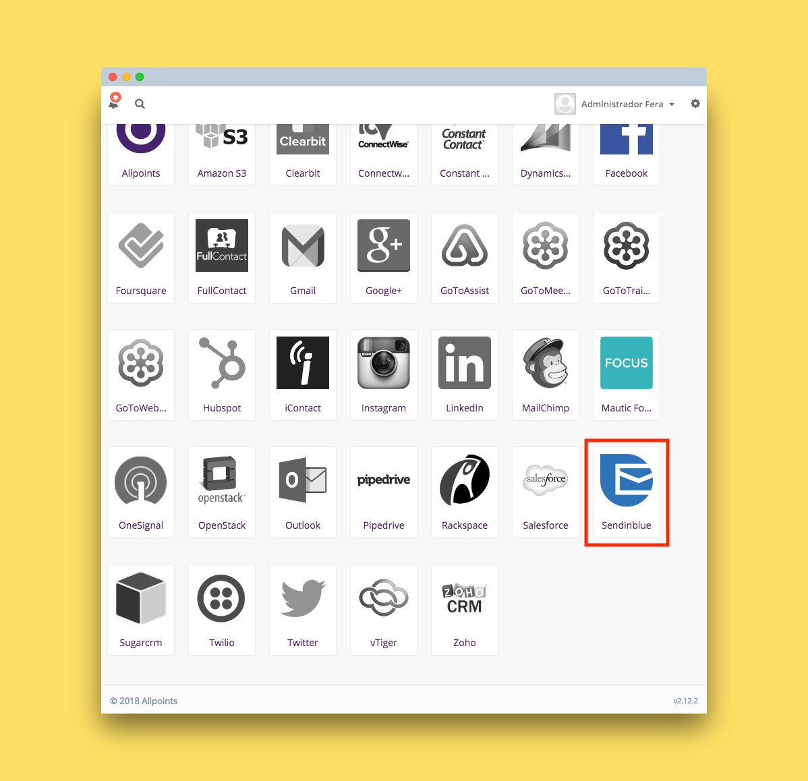
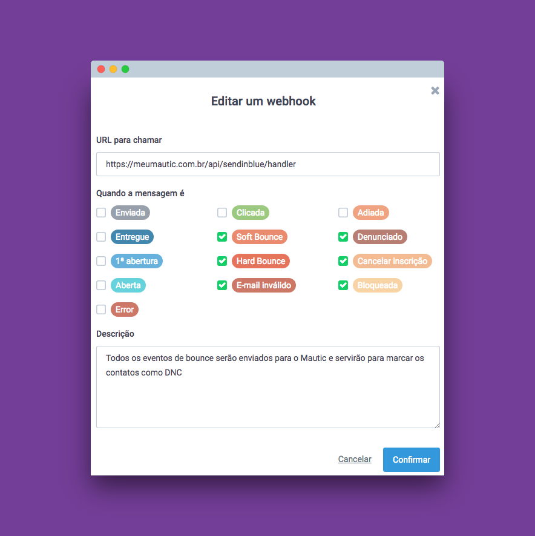

# Sendinblue para Mautic
Desenvolvemos esse plugin para receber informações dos contatos do Sendinblue através de webhooks.

O principal objetivo é alterar um lead para DND(Do not contact) quando houver eventos de Bounce por parte do Sendinblue.

## Configuração Mautic

1. Faça download ou clone o plugin.

2. A pasta _MauticSendinblueBundle_ deverá ficar dentro da pasta _plugins_ localizada na raíz da instalação do seu Mautic.

3. Limpe o cache do seu Mautic.

4. Verifique se a instalação deu certo acessando o menu de plugins dentro do Mautic.

## Configuração Sendinblue

Dentro do painel administrativo do Sendinblue siga os seguintes passos:

1. Menu transacional

2. Configurações

3. Webhook

Nesse ponto você deverá adicionar um webhook. Em sua criação, é possível marcar os tipos de eventos que você considera 

