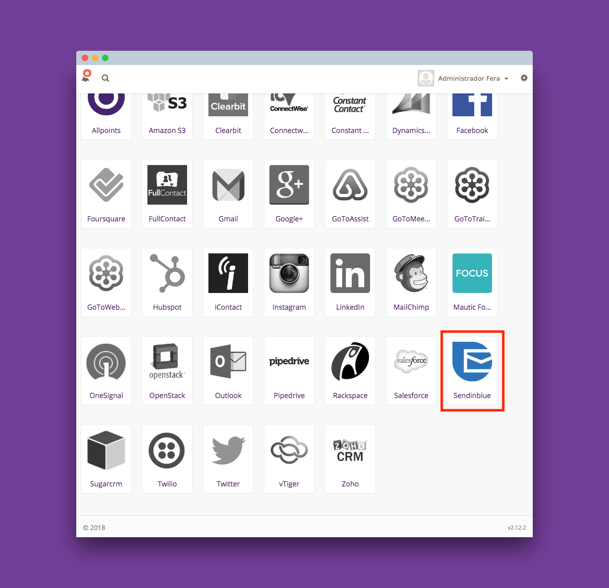

# Sendinblue para Mautic

O Plugin permite selecionar as classificações de Bounces (emails não entregues, rejeitados, cancelamento de inscrição, etc) que você deseja retirar da lista de envios, através da resposta do webhook Sendinblue e aplica aos contatos no Mautic.


O principal objetivo é melhorar a qualidade da campanha e simplificar o processo de classificação dos Leads DNC(Do not contact) para quem utiliza Sendinblue.

## Configuração no Mautic

1 - Clone ou faça o download do plugin.

2 - Cole a pasta _MauticSendinblueBundle_ dentro da pasta _/plugins_ localizada na raíz da instalação do seu Mautic.

3 - Limpe o cache do seu Mautic.

Você pode fazer isso utilizando o comando ```php app/console cache:clear``` ou simplesmente deletando todo conteúdo dentro da pasta _/app/cache/_.

Veja na documentação oficial:
[https://www.mautic.org/docs/en/tips/troubleshooting.html]()


4 - Verifique se a instalação deu certo acessando o menu _settings > plugins_ dentro do Mautic.



## Configuração no Sendinblue

Dentro do painel administrativo do Sendinblue siga os seguintes passos:

1 - Vá em _Menu transacional > Configurações > Webhook_

2 - Clique no botão _Adicionar um Webhook_.

3 - Marque eventos para associar os contatos dentro do Mautic como DNC(Do not contact).


## Resultado

Exemplo de contato marcado como DNC(Do not contact) dentro do Mautic

